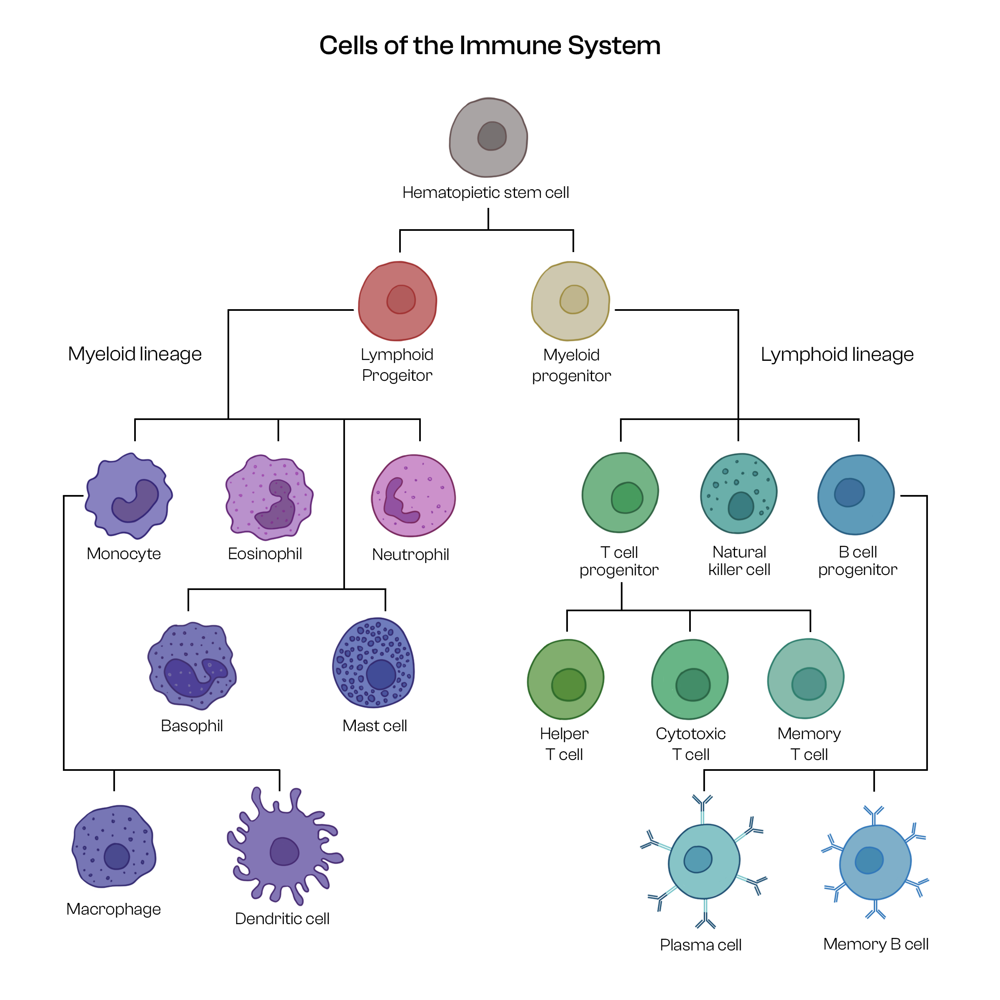

### Aim 

#### Objective :
* Understanding the definition of Flow Cytometry.
* Why flow Cytometry is important?
* Conducting Flow Cytometry of immune cells.
 

There will be 2 tests for practice to get a good hold of the topic. One followed by the Theory and other followed by the Procedure of the experiment.
 

