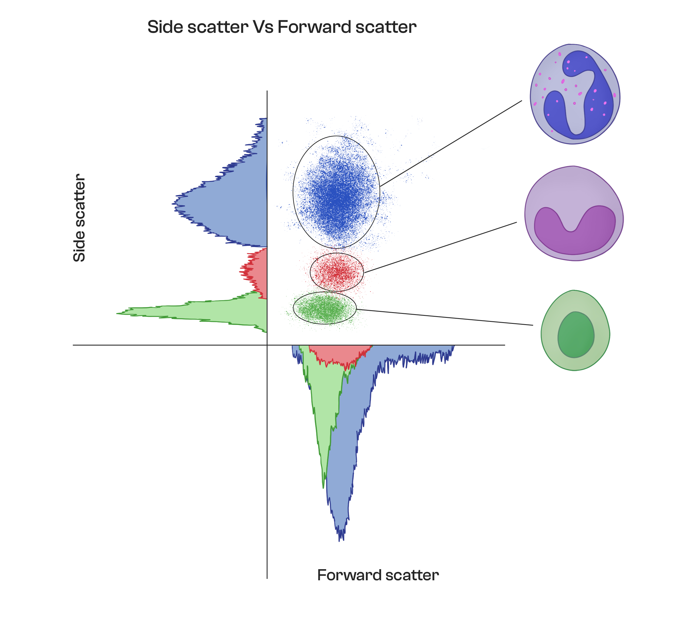

### Procedure :

Flow cytometry is a powerful tool used in biomedical research and clinical settings to analyze and quantify various properties of cells and particles. Here is a step-by-step procedure for flow cytometry :

#### Sample Preparation

The first step in flow cytometry is to prepare the sample. The sample can be any type of cells, bacteria, or particles suspended in a liquid medium. The sample needs to be processed to get a single-cell suspension to ensure the cells can be analyzed individually. The cells may also need to be stained with fluorescent dyes or antibodies to enable detection and sorting.

#### Sample injection

The sample is injected into the flow cytometer through a narrow nozzle or capillary tube. The cells or particles are then separated into single cells by a stream of sheath fluid that runs perpendicular to the sample flow.

#### Light Scatter

As cells pass through the stream of sheath fluid, they encounter two types of laser beams: a forward scatter (FSC) and a side scatter (SSC) beam. These beams interact with the cells and scatter light in different directions, creating a unique pattern that provides information about the size and shape of the cells.

#### Fluorescence detection

The cells then pass through a series of fluorescence detectors that detect the presence of fluorescent tags or antibodies attached to the cells. The fluorescent tags emit light when excited by a laser beam, and the intensity of the emitted light is measured by the detector.

#### Data Analysis

The flow cytometer generates a large amount of data, which is then analyzed using specialized software. The software can interpret the data to identify and quantify various properties of the cells, such as cell size, shape, and fluorescence intensity. The data can also be used to sort the cells based on these properties, allowing researchers to isolate specific populations of cells for further analysis.

 

#### Sorting

If the flow cytometer is equipped with a sorting mechanism, it can be used to sort the cells based on their properties. The sorting mechanism can be based on various principles, such as electrostatic charge, magnetism, or mechanical deflection. The sorted cells can then be collected for further analysis or culture.

Overall, flow cytometry is a powerful technique for analyzing and sorting cells based on their physical and biochemical properties. It has a wide range of applications in biomedical research, clinical diagnostics, and drug discovery.