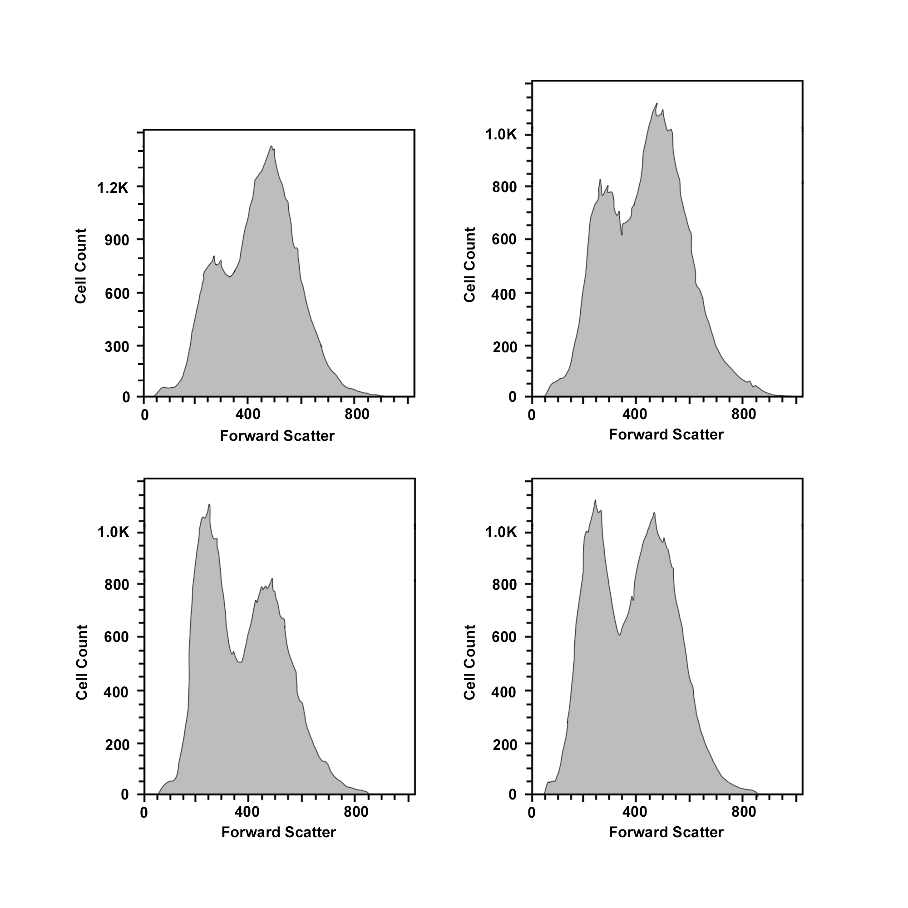

### Theory 

Flow cytometry is a standard laser-based technology that is used in the detection and measurement of physical and chemical characteristics of cells or particles in a heterogeneous fluid mixture. 

Flow	→	in motion 
Cyto	→	cell 
Metry	→	measure 
The properties that can be measured by this process include a particle’s size, granularity or internal complexity. 

<b> 1. Principle</b>
The basic principle of flow cytometry is based on the measurement of light scattered by particles, and the fluorescence observed when these particles are passed in a stream through a laser beam.
 

<b>Light Scattering </b>

* Forward-scattered light (FSC) is proportional to the cell-surface area or size of the cell. It is a measurement of mostly diffracted light and detects rays that are just off the axis of the incident laser beam dispersed in the forward direction by a photodiode.
* Side-scattered light (SSC) indicates the cell granularity or internal complexity of the cells. SSC is a measurement of mostly refracted and reflected light that occurs at any interface within the cell where there is a change in the refractive index. 

The measurements of FSC and SSC are used for the differentiation of cell types in a heterogeneous cell population. 

 

<b>Fluorescence</b>

When a cell is passed through a flow cytometer, it is excited by a laser beam of a specific wavelength. This excitation causes the fluorescent labels on the cell to emit light at a higher wavelength, which is then detected by the flow cytometer. By measuring the intensity of the emitted light, the flow cytometer can determine the presence and amount of specific molecules on or within the cell.

 

 

<b>2. Working</b>
The flow cytometers usually use laser as light sources to produce both scattered and fluorescent signals that are read by photodiodes or photomultiplier tubes. These signals are further converted to electronic signals to be analyzed by a computer and written in a standardized .fcs data file format.

<b>3. Components of flow Cytometers</b>
Fluidics system- This system draws particles such as blood cells, into machine and channels them into single file
Optical system- This system comprises laser and lenses that help in focusing the laser beam
Signal detection and processing system- This system converts the light signal into voltages that are then further recorded

 

 

 

 

 

 

